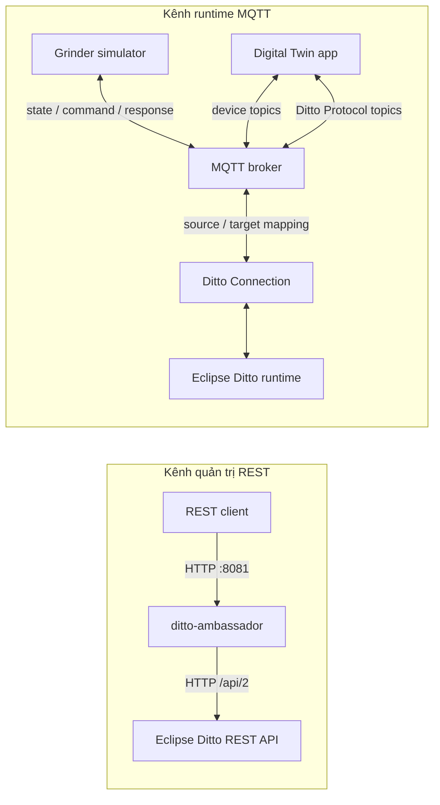

# Smart Grinder Simulator và tích hợp Ditto Ambassador

## 1. Mục đích

`smart_grinder_simulator` mô phỏng một máy xay cà phê và Digital Twin tương ứng. Hai tiến trình chạy độc lập, trao đổi với nhau qua MQTT:

- **Simulator app** giữ trạng thái vật lý của máy xay, thực thi lệnh và phát trạng thái.
- **Digital Twin app** nhận trạng thái của simulator, chuyển trạng thái thành các feature của Eclipse Ditto, nhận lệnh từ Ditto và chuyển lệnh về simulator.
- **Neo4j** là thành phần tùy chọn, lưu cây goal/task và tạo thứ tự lệnh để hoàn thành một goal.
- **Ditto Connection** nối Ditto runtime với MQTT broker bằng built-in payload mapping `Ditto`.
- **Ditto Ambassador** là HTTP gateway bảo vệ thông tin đăng nhập Ditto. Ambassador hỗ trợ Ditto REST API, không phải MQTT broker.

> **Kết luận quan trọng:** simulator hiện tại không thể kết nối MQTT trực tiếp tới `ditto-ambassador:8081`. Port `8081` nhận HTTP. Các biến `MQTT_*` và `DITTO_MQTT_*` phải trỏ tới MQTT broker mà simulator, Digital Twin app và Ditto Connection có thể truy cập.

Response HTTP `2xx` của live message chỉ xác nhận DT app đã nhận và forward
command. Kết quả thực tế của simulator được publish bất đồng bộ qua device state
và response, sau đó state mới được đồng bộ lên Ditto twin.

## 2. Kiến trúc và luồng dữ liệu

Hệ thống có hai kênh tích hợp riêng biệt:



Luồng telemetry:

1. Simulator cập nhật trạng thái mỗi `SIMULATION_INTERVAL` giây.
2. Simulator app chuyển state nội bộ thành các feature `power`, `grinder` và `beans`.
3. State được publish lên `grinder/{THING_ID}/state`.
4. Digital Twin app nhận state rồi publish từng property đã thay đổi lên
   `smart-home/grinder-01/things/twin/commands/modify`.
5. Source của Ditto Connection nhận Ditto Protocol payload và cập nhật Thing.

Luồng command:

1. Ditto phát live message qua target của Ditto Connection.
2. Target publish request lên
   `smart-home/grinder-01/things/live/messages/{subject}`.
3. Digital Twin app lấy command từ subject, lấy params từ `value`, rồi publish
   command lên `grinder/{THING_ID}/commands`.
4. Digital Twin app trả Ditto Protocol acknowledgement ngay lên
   `.../live/messages/{subject}/response`.
5. Simulator thực thi lệnh, publish kết quả nội bộ lên
   `grinder/{THING_ID}/responses`, đồng thời phát state mới để DT app đồng bộ
   ngược lên Ditto.

## 3. Cấu trúc source code

| Module | Trách nhiệm |
| --- | --- |
| `simulator_app` | Khởi tạo máy xay, MQTT bridge phía device và CLI `grinder-sim>` |
| `digital_twin_app` | Kết nối MQTT phía twin, đồng bộ Ditto, nhận command, đọc goal/task từ Neo4j và cung cấp CLI `grinder-dt>` |
| `grinder_simulator` | Mô hình trạng thái, vòng lặp thời gian và business logic của máy xay |
| `core` | Cấu hình, validation, đổi state thành Ditto feature và đổi task Neo4j thành device command |
| `ditto_client` | MQTT bridge cho device/twin, bridge topic Ditto và tạo payload feature/attribute |
| `neo4j_module` | Kết nối Neo4j, query goal/task và xây execution plan |
| `scripts` | Entrypoint chạy hai app và chỉ dẫn seed graph Neo4j |

`smart_grinder_simulator/main.py` hiện khởi động **Digital Twin app**. Để tránh nhầm tiến trình, nên dùng hai entrypoint rõ ràng trong phần [Chạy hệ thống](#7-chạy-hệ-thống).

## 4. Trạng thái và hành vi máy xay

### State nội bộ

| Field | Giá trị/kiểu | Ý nghĩa |
| --- | --- | --- |
| `power_status` | `on` hoặc `off` | Nguồn máy xay |
| `grinder_status` | `idle`, `grinding`, `completed` | Trạng thái vận hành |
| `bean_amount` | số nguyên `0..100` | Lượng hạt hiện tại trong mô phỏng |
| `target_amount` | số nguyên `0..100` | Lượng hạt được đặt cho lần xay |
| `grind_complete` | boolean | Lần xay đã hoàn thành hay chưa |
| `grind_duration_seconds` | số nguyên dương | Thời gian chuẩn của một lần xay |
| `remaining_seconds` | số nguyên không âm | Thời gian xay còn lại |
| `updated_at` | chuỗi ISO-8601 UTC | Lần cập nhật state gần nhất |

State được đổi thành Ditto features như sau:

| Feature | Properties |
| --- | --- |
| `power` | `status` ← `power_status` |
| `grinder` | `status` ← `grinder_status`; `grindComplete` ← `grind_complete`; `grindDurationSeconds` ← `remaining_seconds` |
| `beans` | `beanAmount` ← `bean_amount`; `targetAmount` ← `target_amount` |

Tên `grindDurationSeconds` trong Ditto payload hiện chứa **thời gian còn lại**, đúng theo implementation hiện tại.

### Command và validation

| Command | Params | Hành vi |
| --- | --- | --- |
| `set_bean_amount` | `{"amount": 0..100}` | Đặt `target_amount` và `bean_amount`; giá trị ngoài khoảng gây lỗi validation |
| `grind` | `{}` | Yêu cầu `target_amount > 0`; bật máy, chuyển sang `grinding` và bắt đầu đếm ngược |
| `stop` | `{}` | Tắt máy, chuyển về `idle`, đặt thời gian còn lại bằng `0` |

Khi đếm ngược về `0`, máy chuyển sang `completed`, tắt nguồn, đặt `grind_complete=true` và `bean_amount=0`.

## 5. MQTT topic và payload

Với `THING_ID=smart-home:grinder-01`, dấu `:` là một phần bình thường của MQTT topic.

### Topic giữa simulator và Digital Twin app

| Topic | Producer → Consumer | Payload |
| --- | --- | --- |
| `grinder/smart-home:grinder-01/state` | Simulator → Digital Twin | Object gồm các Ditto feature |
| `grinder/smart-home:grinder-01/commands` | Digital Twin → Simulator | `{"command":"...","params":{...}}` |
| `grinder/smart-home:grinder-01/responses` | Simulator → Digital Twin | Status, command và state kết quả |

Ví dụ state:

```json
{
  "power": {"status": "on"},
  "grinder": {
    "status": "grinding",
    "grindComplete": false,
    "grindDurationSeconds": 58
  },
  "beans": {
    "beanAmount": 20,
    "targetAmount": 20
  }
}
```

Ví dụ command và response:

```json
{"command":"set_bean_amount","params":{"amount":30}}
```

```json
{
  "status": 200,
  "command": "set_bean_amount",
  "result": {
    "power_status": "off",
    "grinder_status": "idle",
    "bean_amount": 30,
    "target_amount": 30,
    "grind_complete": false,
    "grind_duration_seconds": 60,
    "remaining_seconds": 0,
    "updated_at": "2026-01-01T00:00:00+00:00"
  }
}
```

### Topic giữa Digital Twin app và Ditto Connection

| Topic | Hướng | QoS | Mục đích |
| --- | --- | --- | --- |
| `smart-home/grinder-01/things/twin/commands/modify` | Digital Twin → Ditto | 1 phía bridge | Cập nhật attributes/features |
| `smart-home/grinder-01/things/live/messages/{subject}` | Ditto → Digital Twin | 0 | Live message request |
| `smart-home/grinder-01/things/live/messages/{subject}/response` | Digital Twin → Ditto | 0 | Ditto Protocol response |

Digital Twin app chỉ subscribe wildcard một cấp:

```text
smart-home/grinder-01/things/live/messages/+
```

Không đổi wildcard thành `#`, vì nó sẽ bắt lại topic `/response` và có thể tạo
loop. Request từ Ditto là một Ditto Protocol message; command nằm trong MQTT
subject và params nằm trực tiếp trong `value`:

```json
{
  "topic": "smart-home/grinder-01/things/live/messages/set_bean_amount",
  "headers": {"correlation-id": "command-1"},
  "path": "/features/beans/inbox/messages/set_bean_amount",
  "value": {"amount": 30}
}
```

Response giữ nguyên `correlation-id` và đổi `/inbox/messages/` thành
`/outbox/messages/`, kể cả khi message được gửi vào Feature inbox.

## 6. Cấu hình

Tạo cấu hình local từ file mẫu, không commit secret:

```bash
cp smart_grinder_simulator/.env.example smart_grinder_simulator/.env
```

| Biến | Vai trò | Giá trị mặc định trong code |
| --- | --- | --- |
| `THING_ID` | ID Thing dùng trong topic và Ditto | `smart-home:grinder-01` |
| `GOAL_ROOT_ID` | Goal gốc được publish vào attribute | `G_GRINDER_ROOT` |
| `SIMULATION_INTERVAL` | Chu kỳ phát state, đơn vị giây | `2.0` |
| `GRIND_DURATION_SECONDS` | Thời gian một lần xay | `60` |
| `MQTT_HOST`, `MQTT_PORT` | Broker cho topic simulator ↔ twin | host cấu hình / `1883` |
| `MQTT_USERNAME`, `MQTT_PASSWORD` | Credential của MQTT broker | rỗng |
| `DITTO_MQTT_HOST`, `DITTO_MQTT_PORT` | Broker cho topic twin ↔ Ditto Connection | fallback sang `MQTT_*` |
| `DITTO_MQTT_USERNAME`, `DITTO_MQTT_PASSWORD` | Credential MQTT phía Ditto bridge | fallback sang `MQTT_*` |
| `NEO4J_URI` | Neo4j Bolt URI | host cấu hình, port `7687` |
| `NEO4J_USER`, `NEO4J_PASSWORD` | Credential Neo4j | xem `.env.example` và thay trước khi dùng |

Hai broker có thể là cùng một service. Nếu khác nhau, Digital Twin app sẽ mở hai kết nối: `MQTT_*` cho device topics và `DITTO_MQTT_*` cho Ditto topics.

Dependencies Python được cố định trong `smart_grinder_simulator/requirements.txt`: `paho-mqtt`, `neo4j` và `python-dotenv`.

## 7. Chạy hệ thống

Các lệnh dưới đây chạy từ root của repository.

### Cài dependency

```bash
python -m venv .venv
source .venv/bin/activate
python -m pip install -r smart_grinder_simulator/requirements.txt
```

### Chuẩn bị Neo4j (tùy chọn)

```bash
python -m smart_grinder_simulator.scripts.seed_neo4j
```

Lệnh trên chỉ in đường dẫn tới `grinder_graph.cypher`; nó không tự ghi dữ liệu. Mở file được in ra và chạy nội dung Cypher bằng Neo4j Browser hoặc `cypher-shell`. Nếu Neo4j không khả dụng, Digital Twin app vẫn chạy nhưng các lệnh `plan` và `goal` bị vô hiệu hóa.

### Chạy hai tiến trình

Terminal 1 — simulator:

```bash
python -m smart_grinder_simulator.scripts.run_simulation
```

Terminal 2 — Digital Twin:

```bash
python -m smart_grinder_simulator.scripts.run_digital_twin
```

CLI simulator:

- `amount <0-100>`: đặt lượng hạt.
- `grind`: bắt đầu xay.
- `stop`: dừng máy.
- `status`: in state hiện tại.
- `quit`: dừng simulator và ngắt MQTT.

CLI Digital Twin:

- `status`: in state cuối nhận từ simulator.
- `plan <goal_id>`: in goal tree và execution plan từ Neo4j.
- `goal <goal_id> [amount]`: tạo chuỗi command từ plan và gửi về simulator.
- `cmd grind`, `cmd stop`, `cmd amount <value>`: gửi command trực tiếp.
- `quit`: ngắt các kết nối MQTT.

## 8. Khởi động Ditto Ambassador

Ambassador yêu cầu Java 21 và Maven 3.6.3 trở lên, hoặc Docker.

### Docker Compose

```bash
cp ditto-ambassador/.env.example ditto-ambassador/.env
```

Cập nhật tối thiểu các biến sau trong `ditto-ambassador/.env`:

```dotenv
DITTO_BASE_URL=http://your-ditto-host:8080
DITTO_USERNAME=ditto-user
DITTO_PASSWORD=change_me
DITTO_DEVOPS_USERNAME=devops-user
DITTO_DEVOPS_PASSWORD=change_me
```

Sau đó chạy:

```bash
docker compose -f ditto-ambassador/docker-compose.yml up --build -d
curl --fail http://localhost:8081/actuator/health
```

Kết quả health check thành công có `"status":"UP"`.

Ambassador cung cấp:

- `PUT /api/digital-twins/{thingId}`: tạo Thing với `If-None-Match: *`; trả `409 Conflict` nếu Thing đã tồn tại.
- `/api/2/**`: proxy trong suốt sang Ditto, tự gắn Basic Auth phía backend.
- `/api/2/connections/**`: dùng Ditto DevOps credential; các API `/api/2/**` khác dùng regular credential.

## 9. Tạo Thing qua Ambassador

Thing cần một policy đã tồn tại và regular credential của ambassador phải có quyền sử dụng policy đó. Thay `smart-home:grinder-policy` bằng policy ID thực tế trong môi trường Ditto.

```bash
curl --fail-with-body \
  --request PUT \
  --header 'Content-Type: application/json' \
  --data @- \
  'http://localhost:8081/api/digital-twins/smart-home:grinder-01' <<'JSON'
{
  "policyId": "smart-home:grinder-policy",
  "attributes": {
    "goalRootId": "G_GRINDER_ROOT"
  },
  "features": {
    "power": {
      "properties": {
        "status": "off"
      }
    },
    "grinder": {
      "properties": {
        "status": "idle",
        "grindComplete": false,
        "grindDurationSeconds": 0
      }
    },
    "beans": {
      "properties": {
        "beanAmount": 20,
        "targetAmount": 20
      }
    }
  }
}
JSON
```

Kiểm tra Thing qua REST proxy:

```bash
curl --fail-with-body \
  'http://localhost:8081/api/2/things/smart-home:grinder-01'
```

Không gửi Ditto credential từ client; ambassador thay thế mọi header `Authorization` trên `/api/2/**` bằng credential được cấu hình ở backend.

## 10. Cấu hình Ditto Connection cho MQTT

Connection template chính thức của grinder:

```text
ditto-ambassador/examples/grinder-mqtt-connection.json.template
```

Contract source/target bắt buộc:

```json
{
  "sources": [
    {
      "addresses": [
        "smart-home/grinder-01/things/twin/commands/modify",
        "smart-home/grinder-01/things/live/messages/+/response"
      ],
      "consumerCount": 1,
      "qos": 0,
      "authorizationContext": ["nginx:ditto"],
      "headerMapping": {},
      "payloadMapping": ["Ditto"]
    }
  ],
  "targets": [
    {
      "address": "smart-home/{{ thing:name }}/things/live/messages/{{ topic:subject }}",
      "topics": ["_/_/things/live/messages"],
      "qos": 0,
      "authorizationContext": ["nginx:ditto"],
      "headerMapping": {},
      "payloadMapping": ["Ditto"]
    }
  ]
}
```

Lưu ý cho deployment hiện tại:

- Selector hợp lệ là `_/_/things/live/messages`; API từ chối
  `*/*/things/live/messages`.
- Subject target lấy bằng `{{ topic:subject }}`.
- Không dùng target `twin/events`, vì event không forward live command.
- Không source-subscribe `live/messages/#`.
- Không cấu hình `replyTarget`; response đã có source topic
  `.../live/messages/+/response`.
- Policy phải cấp `READ` và `WRITE` cho `nginx:ditto` trên `thing:/` và
  `message:/`.

Tạo connection bằng script, sau khi export MQTT credential:

```bash
export MQTT_USERNAME='<mqtt-user>'
export MQTT_PASSWORD='<mqtt-password>'
export MQTT_HOST='34.143.166.45'
export MQTT_PORT='1883'
export AMBASSADOR_URL='http://localhost:8081'

bash ditto-ambassador/scripts/create-grinder-mqtt-connection.sh
```

Kiểm tra connection đã tạo qua DevOps API của ambassador:

```bash
curl --fail-with-body \
  'http://localhost:8081/api/2/connections/<connection-id>/status'
```

Kết quả yêu cầu `connectionStatus=open` và `liveStatus=open`.

## 11. Kiểm tra end-to-end

1. Ambassador health trả `UP`.
2. `GET /api/2/things/smart-home:grinder-01` qua ambassador trả Thing mong đợi.
3. MQTT broker truy cập được từ simulator, Digital Twin app và Ditto connectivity service.
4. Simulator log `Device listening on grinder/smart-home:grinder-01/commands`.
5. Digital Twin log đã subscribe state/response và
   `smart-home/grinder-01/things/live/messages/+`.
6. Chạy `amount 30`, rồi `grind` trong simulator CLI.
7. Đọc Thing qua ambassador và xác nhận `power`, `grinder`, `beans` thay đổi.
8. Gửi live message với `channel=live&timeout=10` và xác nhận simulator nhận lệnh.
9. Sau `GRIND_DURATION_SECONDS`, xác nhận `grinder.status=completed`, `grinder.grindComplete=true`, `beans.beanAmount=0`.

Có thể quan sát MQTT trong môi trường test bằng client phù hợp với broker, ví dụ:

```bash
mosquitto_sub -h "$MQTT_HOST" -p "${MQTT_PORT:-1883}" -t '#' -v
```

Không nên subscribe `#` trong production nếu broker chứa dữ liệu ngoài phạm vi test.

Ví dụ Thing inbox:

```bash
curl --fail-with-body -i \
  --request POST \
  --header 'Content-Type: application/json' \
  --data '{"amount":30}' \
  'http://localhost:8081/api/2/things/smart-home:grinder-01/inbox/messages/set_bean_amount?channel=live&timeout=10'

curl --fail-with-body -i \
  --request POST \
  --header 'Content-Type: application/json' \
  --data '{}' \
  'http://localhost:8081/api/2/things/smart-home:grinder-01/inbox/messages/grind?channel=live&timeout=10'
```

Feature inbox cũng được hỗ trợ, ví dụ
`/features/beans/inbox/messages/set_bean_amount?channel=live&timeout=10`.
HTTP `200` với `accepted=true` xác nhận DT app đã forward command; kiểm tra
`grinder/{THING_ID}/responses` và state trên Ditto để biết kết quả thực tế.

## 12. Xử lý sự cố và giới hạn hiện tại

| Triệu chứng | Nguyên nhân thường gặp | Cách kiểm tra |
| --- | --- | --- |
| Kết nối tới port `8081` bằng MQTT thất bại | `8081` là HTTP ambassador, không phải MQTT | Dùng `curl /actuator/health`; trỏ MQTT tới broker port, thường là `1883` hoặc `8883` |
| State có trên `grinder/.../state` nhưng Ditto không đổi | Digital Twin app chưa chạy hoặc sai `THING_ID` | So sánh topic/log của cả hai app |
| Có message `.../twin/commands/modify` nhưng Thing không đổi | Source, built-in mapping hoặc policy sai | Kiểm tra connection metrics/log và quyền `nginx:ditto` |
| REST trả `404` | Thing hoặc policy chưa được tạo, hoặc `DITTO_BASE_URL` sai | Gọi health, kiểm tra ambassador log và Ditto endpoint |
| Tạo Thing trả `409` | Thing ID đã tồn tại | Dùng `GET /api/2/things/{thingId}`; create endpoint cố ý không ghi đè |
| REST trả `502`/`504` | Ambassador không kết nối được Ditto hoặc Ditto timeout | Kiểm tra `DITTO_BASE_URL`, network và timeout |
| MQTT connect thất bại | Host/port, credential, TLS hoặc ACL sai | Kiểm tra broker log và thử MQTT client độc lập |
| Ditto command không tới simulator | Request thiếu `channel=live`, sai target selector hoặc DT app chưa subscribe | Kiểm tra target `_/_/things/live/messages` và topic `.../live/messages/+` |
| HTTP live message trả `408` | Ditto không nhận được response đúng contract | Kiểm tra response source, `correlation-id`, outbox path và policy `message:/` |
| HTTP trả `200` nhưng simulator không đổi state | `200` chỉ xác nhận command đã được forward | Kiểm tra `grinder/{THING_ID}/commands`, `responses` và validation params |
| `goal`/`plan` không hoạt động | Neo4j không kết nối được hoặc graph chưa seed | Kiểm tra `NEO4J_*` và chạy Cypher được chỉ ra bởi script seed |

Giới hạn bảo mật và vận hành:

- Ambassador hiện **không xác thực request đầu vào**. Chỉ expose trong mạng tin cậy hoặc đặt sau reverse proxy/firewall có authentication.
- Ambassador không proxy MQTT, WebSocket hoặc TCP; nó chỉ route HTTP Ditto API.
- MQTT bridge dùng MQTT thường theo host/port và chưa cấu hình TLS trong code hiện tại.
- Kết nối Paho trả về sau một khoảng chờ cố định; giá trị `True` từ hàm connect không bảo đảm callback MQTT đã nhận `rc=0`.
- Live-message response giữ `correlation-id` và Thing/Feature outbox path theo
  Ditto Protocol. Đây vẫn là acknowledgement nhận/forward; device result là
  response bất đồng bộ riêng.

Để chẩn đoán mapping hoặc enforcement, đọc metrics và logs của connection:

```bash
curl 'http://localhost:8081/api/2/connections/<connection-id>/metrics'
curl 'http://localhost:8081/api/2/connections/<connection-id>/logs'
```
