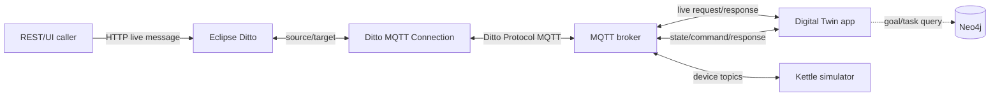

# Smart Kettle Simulator và tích hợp Eclipse Ditto

## 1. Mục đích

`smart_kettle_simulator` mô phỏng một ấm đun nước và Digital Twin tương ứng. Hệ thống gồm hai tiến trình độc lập:

- **Simulator app** giữ trạng thái vật lý, mô phỏng quá trình đun/nguội, thực thi command và phát state qua MQTT.
- **Digital Twin app (DT app)** nhận state từ simulator, đồng bộ attributes/features lên Eclipse Ditto, nhận live message từ Ditto và forward command về simulator.
- **Neo4j** là thành phần tùy chọn, lưu goal/task và tạo thứ tự command để thực hiện goal.
- **Ditto Connection** nối Ditto runtime với MQTT broker bằng built-in payload mapping `Ditto`.
- **Ditto Ambassador** là HTTP gateway cho Ditto REST API; đây không phải MQTT broker.

Response HTTP `2xx` của live message chỉ xác nhận DT app đã nhận và forward command. Kết quả thực tế của simulator được publish bất đồng bộ qua state và cập nhật lên Ditto twin sau đó.

## 2. Kiến trúc và luồng dữ liệu



### Luồng simulator → Ditto

1. Simulator phát state lên `kettle/{THING_ID}/state`.
2. DT app chuyển state thành Ditto features `power` và `water`.
3. DT app publish từng property thay đổi lên `{namespace}/{name}/things/twin/commands/modify`.
4. Source của Ditto Connection nhận Ditto Protocol payload và cập nhật Thing.
5. Property không thay đổi không được publish lại nhờ cache trong `DittoTwinBridge`.

### Luồng Ditto → simulator

1. Caller gửi message vào Thing hoặc Feature inbox với `channel=live`.
2. Target của Ditto Connection publish request lên `{namespace}/{name}/things/live/messages/{subject}`.
3. DT app subscribe wildcard một cấp `.../live/messages/+`, lấy subject và `value`, rồi publish command lên `kettle/{THING_ID}/commands`.
4. DT app trả Ditto Protocol response ngay lên `.../{subject}/response`.
5. Simulator thực thi command, publish kết quả nội bộ lên `kettle/{THING_ID}/responses`, đồng thời phát state mới.
6. DT app nhận state mới và đồng bộ ngược lên Ditto twin.

## 3. Cấu trúc source code

| Module | Trách nhiệm |
| --- | --- |
| `simulator_app` | Khởi tạo simulator, MQTT bridge phía device và CLI `sim>` |
| `digital_twin_app` | Đồng bộ Ditto, forward command, đọc Neo4j và CLI `dt>` |
| `kettle_simulator` | State, command validation và mô phỏng vật lý |
| `core` | Cấu hình, mapping state, mapping task → device command |
| `ditto_client` | MQTT bridge nội bộ, Ditto Protocol bridge và payload builder |
| `neo4j_module` | Kết nối Neo4j, query goal/task và xây execution plan |
| `scripts` | Entrypoint chạy simulator, DT app và chỉ dẫn seed Neo4j |
| `tests` | Unit test core, simulator, Ditto bridge và connection contract |

Entrypoint rõ ràng:

```text
python -m smart_kettle_simulator.scripts.run_simulation
python -m smart_kettle_simulator.scripts.run_digital_twin
```

`python -m smart_kettle_simulator.main` cũng khởi động DT app.

## 4. Trạng thái và hành vi của kettle

### State nội bộ

| Field | Kiểu/giá trị | Mặc định | Ý nghĩa |
| --- | --- | --- | --- |
| `temperature` | số thực | `25.0` | Nhiệt độ nước hiện tại, °C |
| `water_level` | số nguyên `0..100` | `50` | Mức nước phần trăm |
| `power_status` | `on` hoặc `off` | `off` | Trạng thái nguồn |
| `target_temperature` | số nguyên `70..100` | `100` | Nhiệt độ mục tiêu, °C |
| `updated_at` | ISO-8601 UTC | thời điểm tạo | Lần cập nhật state gần nhất |

Mapping sang Ditto:

| Ditto feature/property | Nguồn |
| --- | --- |
| `power.properties.status` | `power_status` |
| `water.properties.temperature` | `temperature` |
| `water.properties.waterLevel` | `water_level` |
| `water.properties.targetTemperature` | `target_temperature` |
| `attributes.goalRootId` | `GOAL_ROOT_ID` |

### Command và validation

| Command | Params | Hành vi |
| --- | --- | --- |
| `turn_on` | `{}` | Bật nguồn; lỗi nếu `water_level <= 0` |
| `turn_off` | `{}` | Tắt nguồn |
| `set_target_temperature` | `{"temperature":70..100}` | Đặt nhiệt độ mục tiêu |
| `set_water_level` | `{"water_level":0..100}` | Đặt mức nước; mức `0` tự tắt nguồn |

Nếu thiếu param, implementation hiện tại dùng default:

- `set_target_temperature` không có `temperature` sẽ đặt `100`.
- `set_water_level` không có `water_level` sẽ đặt `0` và tắt nguồn.

Giá trị ngoài khoảng hoặc command không hỗ trợ tạo `ValidationError`.

### Mô phỏng vật lý

- Khi nguồn bật và có nước, mỗi chu kỳ nhiệt độ tăng ngẫu nhiên khoảng `0.5..1.2°C`, không vượt quá target.
- Khi nhiệt độ đạt target, simulator tự tắt nguồn.
- Nếu nhiệt độ cao hơn target, nhiệt độ giảm `0.2°C` mỗi chu kỳ và nguồn tắt.
- Khi nguồn tắt và nhiệt độ lớn hơn `25°C`, nhiệt độ giảm `0.3°C` mỗi chu kỳ, không thấp hơn `25°C`.
- Nếu mức nước trở thành `0`, nguồn tự tắt.
- Chu kỳ mặc định là `2` giây, cấu hình bằng `SIMULATION_INTERVAL`.

## 5. MQTT topic contract

Ví dụ dưới đây dùng `THING_ID=smart-home:kettle-01`.

### Simulator ↔ DT app

| Topic | Producer → Consumer | QoS | Payload |
| --- | --- | --- | --- |
| `kettle/smart-home:kettle-01/state` | Simulator → DT app | 1 | Ditto feature object |
| `kettle/smart-home:kettle-01/commands` | DT app → Simulator | 1 | `{"command":"...","params":{...}}` |
| `kettle/smart-home:kettle-01/responses` | Simulator → DT app | 1 | Status và state/error nội bộ |

Ví dụ state:

```json
{
  "power": {"status": "on"},
  "water": {
    "temperature": 37.5,
    "waterLevel": 80,
    "targetTemperature": 95
  }
}
```

Ví dụ command:

```json
{
  "command": "set_target_temperature",
  "params": {"temperature": 95}
}
```

### DT app ↔ Ditto Connection

| Topic | Hướng | QoS | Mục đích |
| --- | --- | --- | --- |
| `smart-home/kettle-01/things/twin/commands/modify` | DT app → Ditto | 1 phía bridge | Cập nhật attributes/features |
| `smart-home/kettle-01/things/live/messages/{subject}` | Ditto → DT app | 0 | Live message request |
| `smart-home/kettle-01/things/live/messages/{subject}/response` | DT app → Ditto | 0 | Ditto Protocol response |

DT app chỉ subscribe:

```text
smart-home/kettle-01/things/live/messages/+
```

Wildcard `+` chỉ khớp một level, do đó không bắt response có thêm level `/response`. Không đổi thành `live/messages/#` vì sẽ bắt lại response và có thể tạo loop.

Response giữ nguyên `correlation-id` và đổi path:

```text
/inbox/messages/{subject}
→ /outbox/messages/{subject}

/features/{featureId}/inbox/messages/{subject}
→ /features/{featureId}/outbox/messages/{subject}
```

## 6. Cấu hình môi trường

Tạo hoặc cập nhật `smart_kettle_simulator/.env`. Không commit credential thật.

```dotenv
THING_ID=smart-home:kettle-01
GOAL_ROOT_ID=G_KETTLE_ROOT
SIMULATION_INTERVAL=2.0

MQTT_HOST=34.143.166.45
MQTT_PORT=1883
MQTT_USERNAME=
MQTT_PASSWORD=

DITTO_MQTT_HOST=34.143.166.45
DITTO_MQTT_PORT=1883
DITTO_MQTT_USERNAME=
DITTO_MQTT_PASSWORD=

NEO4J_URI=bolt://34.143.166.45:7687
NEO4J_USER=neo4j
NEO4J_PASSWORD=change_me
```

| Biến | Vai trò |
| --- | --- |
| `THING_ID` | ID Thing, đồng thời dùng để tạo MQTT topic |
| `GOAL_ROOT_ID` | Attribute goal gốc publish lên Ditto khi DT app kết nối |
| `SIMULATION_INTERVAL` | Chu kỳ cập nhật vật lý và phát state |
| `MQTT_*` | Broker cho simulator ↔ DT app |
| `DITTO_MQTT_*` | Broker cho DT app ↔ Ditto Connection; fallback sang `MQTT_*` |
| `NEO4J_*` | Kết nối goal/task graph, tùy chọn |

Hai nhóm MQTT có thể trỏ cùng một broker. Ditto, DT app và simulator phải truy cập được broker tương ứng.

## 7. Chuẩn bị Ditto

### Thing và policy

Thing mẫu nằm tại `mqtt_project/ditto_template.json`. Tạo/cập nhật Thing theo quy trình quản trị của môi trường Ditto.

Policy gắn với Thing phải cấp subject `nginx:ditto`:

```json
{
  "thing:/": {
    "grant": ["READ", "WRITE"],
    "revoke": []
  },
  "message:/": {
    "grant": ["READ", "WRITE"],
    "revoke": []
  }
}
```

`READ` cần cho outbound target; `WRITE` cần cho source cập nhật twin và đưa response trở lại Ditto.

### MQTT Connection

File mẫu chính thức của kettle:

```text
mqtt_project/ditto_connection.json
```

Contract bắt buộc:

```json
{
  "sources": [
    {
      "addresses": [
        "smart-home/kettle-01/things/twin/commands/modify",
        "smart-home/kettle-01/things/live/messages/+/response"
      ],
      "consumerCount": 1,
      "qos": 0,
      "authorizationContext": ["nginx:ditto"],
      "headerMapping": {},
      "payloadMapping": ["Ditto"]
    }
  ],
  "targets": [
    {
      "address": "smart-home/{{ thing:name }}/things/live/messages/{{ topic:subject }}",
      "topics": ["_/_/things/live/messages"],
      "qos": 0,
      "authorizationContext": ["nginx:ditto"],
      "headerMapping": {},
      "payloadMapping": ["Ditto"]
    }
  ]
}
```

Với Ditto deployment hiện tại:

- Selector hợp lệ là `_/_/things/live/messages`; API từ chối `*/*/things/live/messages`.
- Subject target lấy bằng `{{ topic:subject }}`.
- Không dùng target `twin/events`: event chỉ phản ánh thay đổi twin, không forward command tới simulator.
- Không source-subscribe `twin/messages/#` hoặc `live/messages/#`.
- Không cần `replyTarget`; response đã có source topic riêng.

Tạo connection:

```bash
export DITTO_HTTP_API=http://34.143.166.45:8080/api/2
export DITTO_DEVOPS_USER='<devops-user>'
export DITTO_DEVOPS_PASSWORD='<devops-password>'

curl --fail-with-body \
  -u "$DITTO_DEVOPS_USER:$DITTO_DEVOPS_PASSWORD" \
  -X POST \
  -H 'Content-Type: application/json' \
  --data @mqtt_project/ditto_connection.json \
  "$DITTO_HTTP_API/connections"
```

Cập nhật connection đã có:

```bash
export CONNECTION_ID='<connection-id>'

curl --fail-with-body \
  -u "$DITTO_DEVOPS_USER:$DITTO_DEVOPS_PASSWORD" \
  -X PUT \
  -H 'Content-Type: application/json' \
  --data @mqtt_project/ditto_connection.json \
  "$DITTO_HTTP_API/connections/$CONNECTION_ID"
```

Kiểm tra trạng thái:

```bash
curl --fail-with-body \
  -u "$DITTO_DEVOPS_USER:$DITTO_DEVOPS_PASSWORD" \
  "$DITTO_HTTP_API/connections/$CONNECTION_ID/status"
```

Yêu cầu kết quả có:

```json
{
  "connectionStatus": "open",
  "liveStatus": "open"
}
```

## 8. Cài đặt và chạy hệ thống

Chạy các lệnh từ root repository:

```bash
cd "/home/viet/Desktop/SME Lab/WoDT-pattern"
python -m venv .venv
source .venv/bin/activate
python -m pip install -r smart_kettle_simulator/requirements.txt
python -m pip install pytest
```

Terminal 1 — DT app:

```bash
source .venv/bin/activate
python -m smart_kettle_simulator.scripts.run_digital_twin
```

Log mong đợi:

```text
[MQTTBridge] Twin listening on kettle/smart-home:kettle-01/state and kettle/smart-home:kettle-01/responses
[DittoBridge] Listening on smart-home/kettle-01/things/live/messages/+
dt>
```

Terminal 2 — simulator:

```bash
source .venv/bin/activate
python -m smart_kettle_simulator.scripts.run_simulation
```

Log mong đợi:

```text
[MQTTBridge] Device listening on kettle/smart-home:kettle-01/commands
sim>
```

Terminal 3 — theo dõi Ditto MQTT topics:

```bash
mosquitto_sub -h 34.143.166.45 -p 1883 -v \
  -t 'smart-home/kettle-01/things/#'
```

Terminal 4 — theo dõi device topics:

```bash
mosquitto_sub -h 34.143.166.45 -p 1883 -v \
  -t 'kettle/smart-home:kettle-01/#'
```

Nếu broker yêu cầu xác thực, bổ sung `-u '<user>' -P '<password>'`.

## 9. CLI reference

### Simulator CLI `sim>`

| Lệnh | Ý nghĩa |
| --- | --- |
| `status` | In state hiện tại |
| `on` | Bật nguồn |
| `off` | Tắt nguồn |
| `temp <70-100>` | Đặt target temperature |
| `water <0-100>` | Đặt mức nước |
| `quit` | Dừng simulator và ngắt MQTT |

### Digital Twin CLI `dt>`

| Lệnh | Ý nghĩa |
| --- | --- |
| `status` | In state cuối nhận từ simulator |
| `cmd on` | Forward `turn_on` |
| `cmd off` | Forward `turn_off` |
| `cmd temp <70-100>` | Forward `set_target_temperature` |
| `cmd water <0-100>` | Forward `set_water_level` |
| `plan <goal_id>` | In goal tree và execution plan từ Neo4j |
| `goal <goal_id> [temperature] [water_level]` | Build và gửi chuỗi command của goal |
| `quit` | Ngắt các kết nối MQTT |

## 10. Neo4j goal/task

Graph nằm tại:

```text
smart_kettle_simulator/neo4j_module/kettle_graph.cypher
```

Lệnh sau chỉ in đường dẫn file, không tự seed database:

```bash
python -m smart_kettle_simulator.scripts.seed_neo4j
```

Chạy Cypher bằng Neo4j Browser hoặc `cypher-shell`. Các goal chính:

| Goal | Chức năng |
| --- | --- |
| `G_KETTLE_ROOT` | Goal gốc điều khiển thermal output |
| `G_K1` | Tăng nhiệt độ nước |
| `G_K1_1` | Đun tới nhiệt độ mục tiêu |
| `G_K1_2` | Đảm bảo mức nước |
| `G_K2` | Giảm/dừng gia nhiệt |

Mapping task:

```text
SET_VOLUME → set_water_level
SET_TEMP   → set_target_temperature
TURN_ON    → turn_on
TURN_OFF   → turn_off
```

Execution plan ưu tiên `SET_VOLUME`, `SET_TEMP`, `TURN_ON`, sau đó `TURN_OFF`.

Ví dụ:

```text
dt> plan G_K1
dt> goal G_K1 95 80
dt> goal G_K2
```

Nếu Neo4j không kết nối được, DT app vẫn chạy telemetry/live command nhưng `plan` và `goal` không khả dụng.

## 11. Kế hoạch test đầy đủ

Đặt biến dùng chung:

```bash
export DITTO_HTTP_API=http://34.143.166.45:8080/api/2
export DITTO_USER=ditto
export DITTO_PASSWORD=ditto
export THING_ID='smart-home:kettle-01'
```

### Test 1 — Unit test

```bash
python -m pytest -q smart_kettle_simulator/tests
```

Test hiện tại kiểm tra:

- Mapping state thành features.
- `turn_on`, target temperature và water level.
- Mapping/order goal task.
- Ditto request subscription không bắt response.
- Thing/Feature response path và `correlation-id`.
- Response `500` khi bridge callback lỗi.
- Source/target connection contract.

### Test 2 — State mặc định và CLI simulator

Tại `sim>`:

```text
status
```

Kỳ vọng gần tương đương:

```json
{
  "temperature": 25.0,
  "water_level": 50,
  "power_status": "off",
  "target_temperature": 100
}
```

Test toàn bộ command hợp lệ:

```text
water 80
temp 95
on
status
off
status
```

Kỳ vọng lần lượt:

- `water_level=80`.
- `target_temperature=95`.
- `power_status=on` và nhiệt độ tăng theo chu kỳ.
- Sau `off`, `power_status=off` và nhiệt độ giảm dần về `25°C`.

### Test 3 — Validation và safety

Thực hiện từng trường hợp độc lập tại `sim>`:

```text
temp 69
temp 101
water -1
water 101
```

Kỳ vọng `ValidationError` tương ứng; CLI hiện không bắt lỗi validation nên tiến trình có thể kết thúc. Khi test lỗi bằng CLI, khởi động lại simulator trước case tiếp theo.

Test cạn nước và interlock:

```text
water 0
status
on
```

Kỳ vọng:

- `water 0` đặt `water_level=0` và tự chuyển `power_status=off`.
- `on` khi mức nước bằng `0` trả lỗi `Water level must be greater than 0 before turning on.`

Test command không hỗ trợ an toàn hơn bằng unit test hoặc publish MQTT trực tiếp:

```bash
mosquitto_pub -h 34.143.166.45 -p 1883 \
  -t 'kettle/smart-home:kettle-01/commands' \
  -m '{"command":"unsupported","params":{}}'
```

Kỳ vọng topic `.../responses` nhận status `500` với thông báo `Unsupported command`.

### Test 4 — Mô phỏng vật lý

Tại `sim>`:

```text
water 80
temp 70
on
```

Quan sát `status` hoặc MQTT state qua nhiều chu kỳ:

- Nhiệt độ tăng dần và không vượt `70°C`.
- Khi đạt target, nguồn tự tắt.
- Sau đó nhiệt độ giảm dần về nhiệt độ môi trường `25°C`.

Để test nhanh, tạm đặt `SIMULATION_INTERVAL=0.2` trong môi trường test rồi khởi động lại simulator. Không dùng chu kỳ quá nhỏ trên môi trường dùng chung vì sẽ phát nhiều MQTT message.

### Test 5 — Simulator → DT app → Ditto

Đảm bảo DT app và simulator đều đang chạy. Tại `sim>`:

```text
water 80
temp 95
on
```

Đọc Thing:

```bash
curl --fail-with-body -sS \
  -u "$DITTO_USER:$DITTO_PASSWORD" \
  "$DITTO_HTTP_API/things/$THING_ID" | python -m json.tool
```

Kiểm tra:

```text
attributes.goalRootId = G_KETTLE_ROOT
features.power.properties.status = on
features.water.properties.waterLevel = 80
features.water.properties.targetTemperature = 95
features.water.properties.temperature tăng dần
```

Sau lệnh `off`, kiểm tra `power.status=off`. Sau `water 0`, kiểm tra `waterLevel=0` và `power.status=off`.

Luồng đạt yêu cầu nếu state trên Ditto phản ánh simulator sau tối đa vài chu kỳ và broker không ghi lỗi mapping/enforcement.

### Test 6 — DT CLI → simulator → Ditto

Tại `dt>`:

```text
cmd water 75
cmd temp 90
cmd on
status
cmd off
```

Kỳ vọng:

- Device topic nhận đúng bốn command.
- DT log nhận response status `200` từ simulator cho từng command.
- `dt> status` phản ánh state mới nhất.
- Ditto twin lần lượt cập nhật `waterLevel=75`, `targetTemperature=90`, power `on` rồi `off`.

### Test 7 — Ditto Thing inbox → DT app → simulator

Các request phải có `channel=live`; nếu thiếu, message đi trên twin channel, không khớp target và caller có thể timeout.

Test `turn_on`:

```bash
curl --fail-with-body -i \
  -u "$DITTO_USER:$DITTO_PASSWORD" \
  -X POST \
  -H 'Content-Type: application/json' \
  --data '{}' \
  "$DITTO_HTTP_API/things/$THING_ID/inbox/messages/turn_on?channel=live&timeout=10"
```

Test `turn_off`:

```bash
curl --fail-with-body -i \
  -u "$DITTO_USER:$DITTO_PASSWORD" \
  -X POST \
  -H 'Content-Type: application/json' \
  --data '{}' \
  "$DITTO_HTTP_API/things/$THING_ID/inbox/messages/turn_off?channel=live&timeout=10"
```

Test target temperature:

```bash
curl --fail-with-body -i \
  -u "$DITTO_USER:$DITTO_PASSWORD" \
  -X POST \
  -H 'Content-Type: application/json' \
  --data '{"temperature":95}' \
  "$DITTO_HTTP_API/things/$THING_ID/inbox/messages/set_target_temperature?channel=live&timeout=10"
```

Test water level:

```bash
curl --fail-with-body -i \
  -u "$DITTO_USER:$DITTO_PASSWORD" \
  -X POST \
  -H 'Content-Type: application/json' \
  --data '{"water_level":80}' \
  "$DITTO_HTTP_API/things/$THING_ID/inbox/messages/set_water_level?channel=live&timeout=10"
```

Mỗi request hợp lệ phải trả:

```http
HTTP/1.1 200 OK
```

```json
{"command":"<subject>","accepted":true}
```

DT log phải có:

```text
[Ditto -> DT] forward <subject> <params>
[DT] send <subject> <params>
[DT Response] {'status': 200, ...}
```

Sau đó đọc Thing để xác nhận state thực tế.

### Test 8 — Ditto Feature inbox

Test Feature inbox của `water`:

```bash
curl --fail-with-body -i \
  -u "$DITTO_USER:$DITTO_PASSWORD" \
  -X POST \
  -H 'Content-Type: application/json' \
  --data '{"temperature":95}' \
  "$DITTO_HTTP_API/things/$THING_ID/features/water/inbox/messages/set_target_temperature?channel=live&timeout=10"
```

```bash
curl --fail-with-body -i \
  -u "$DITTO_USER:$DITTO_PASSWORD" \
  -X POST \
  -H 'Content-Type: application/json' \
  --data '{"water_level":70}' \
  "$DITTO_HTTP_API/things/$THING_ID/features/water/inbox/messages/set_water_level?channel=live&timeout=10"
```

Test Feature inbox của `power`:

```bash
curl --fail-with-body -i \
  -u "$DITTO_USER:$DITTO_PASSWORD" \
  -X POST \
  -H 'Content-Type: application/json' \
  --data '{}' \
  "$DITTO_HTTP_API/things/$THING_ID/features/power/inbox/messages/turn_on?channel=live&timeout=10"
```

Kỳ vọng Feature response path giữ nguyên feature prefix, ví dụ:

```text
/features/water/outbox/messages/set_target_temperature
```

### Test 9 — Response contract, correlation ID và không loop

Trong MQTT monitor, một `turn_on` phải tạo đúng một cặp:

```text
smart-home/kettle-01/things/live/messages/turn_on
smart-home/kettle-01/things/live/messages/turn_on/response
```

Request mẫu:

```json
{
  "topic": "smart-home/kettle-01/things/live/messages/turn_on",
  "headers": {"correlation-id": "..."},
  "path": "/inbox/messages/turn_on",
  "value": {}
}
```

Response mẫu:

```json
{
  "topic": "smart-home/kettle-01/things/live/messages/turn_on",
  "headers": {
    "content-type": "application/json",
    "correlation-id": "..."
  },
  "path": "/outbox/messages/turn_on",
  "status": 200,
  "value": {
    "command": "turn_on",
    "accepted": true
  }
}
```

Tiêu chí đạt:

- Request và response có cùng `correlation-id`.
- Thing inbox đổi thành Thing outbox; Feature inbox đổi thành Feature outbox.
- Mỗi command chỉ có một request và một response.
- Không có request/response lặp lại liên tục sau khi caller hoàn tất.

### Test 10 — Lỗi thực thi bất đồng bộ

Đặt mức nước về `0`, sau đó gửi `turn_on` qua Ditto:

```bash
curl --fail-with-body -i \
  -u "$DITTO_USER:$DITTO_PASSWORD" \
  -X POST \
  -H 'Content-Type: application/json' \
  --data '{}' \
  "$DITTO_HTTP_API/things/$THING_ID/inbox/messages/turn_on?channel=live&timeout=10"
```

Theo contract hiện tại:

- Caller vẫn có thể nhận `200 accepted=true` vì DT app đã forward command thành công.
- Simulator từ chối command và publish status `500` trên `kettle/{THING_ID}/responses`.
- DT app in `[DT Response]` với lỗi.
- Ditto twin vẫn giữ `power.status=off`.

Đây là hành vi chủ đích: acknowledgement và device result là hai giai đoạn riêng.

### Test 11 — Neo4j plan và goal execution

Sau khi seed graph, tại `dt>`:

```text
plan G_K1
goal G_K1 95 80
```

Kỳ vọng thứ tự command:

```text
set_water_level {"water_level":80}
set_target_temperature {"temperature":95}
turn_on {}
```

Đọc Ditto twin và xác nhận water level, target temperature, power và nhiệt độ thực tế.

Test goal dừng:

```text
goal G_K2
```

Kỳ vọng `turn_off` và Ditto twin chuyển `power.status=off`.

### Test 12 — Panel D: Live Messages trong web UI

Panel D dùng Thing inbox. Subject phải là đúng command, không dùng placeholder ví dụ `tempAlert`:

| Subject | Payload |
| --- | --- |
| `turn_on` | `{}` |
| `turn_off` | `{}` |
| `set_target_temperature` | `{"temperature":95}` |
| `set_water_level` | `{"water_level":80}` |

Implementation hiện tại của `client-aplication/src/components/Module2DTStatus.jsx` chưa thêm query `channel=live`. Để Panel D đi qua live-message target, URL gửi message phải có:

```js
const url =
  `${BASE_URL}/things/${encodeURIComponent(thingId)}` +
  `/inbox/messages/${encodeURIComponent(messageSubject)}` +
  `?channel=live&timeout=10`;
```

Nếu chưa sửa UI, dùng các lệnh `curl` ở Test 7 và Test 8. Panel D chỉ test Thing inbox; dùng REST API để kiểm tra chính xác Feature inbox/outbox.

## 12. Checklist nghiệm thu

- [ ] Unit test pass.
- [ ] Ditto Connection `open/open`.
- [ ] Policy có `READ` và `WRITE` cho `nginx:ditto` trên `thing:/` và `message:/`.
- [ ] DT app và simulator kết nối broker thành công.
- [ ] Simulator CLI chạy đủ `status`, `water`, `temp`, `on`, `off`.
- [ ] Validation biên và interlock cạn nước hoạt động.
- [ ] Nhiệt độ tăng, tự dừng tại target và nguội về `25°C`.
- [ ] Simulator state cập nhật đủ attributes/features trên Ditto.
- [ ] DT CLI forward đủ bốn command.
- [ ] Thing inbox chạy đủ bốn subject.
- [ ] Feature inbox chạy cho `water` và `power`.
- [ ] HTTP caller nhận acknowledgement đúng contract.
- [ ] Simulator result và state thực tế xuất hiện sau acknowledgement.
- [ ] Correlation ID và Thing/Feature outbox path đúng.
- [ ] Broker chỉ có một request và một response cho mỗi command, không loop.
- [ ] Neo4j `plan`, heat goal và stop goal hoạt động khi graph khả dụng.
- [ ] Tất cả process test được dừng bằng `quit`.

## 13. Troubleshooting

### HTTP `408 command.timeout`

Kiểm tra:

- Request có `channel=live`.
- Target selector là `_/_/things/live/messages`.
- Target address dùng `{{ topic:subject }}`.
- DT app đang subscribe `.../live/messages/+`.
- Source có `.../live/messages/+/response`.
- Policy cho `nginx:ditto` đủ quyền.

### Target message bị drop

Đọc connection metrics/logs:

```bash
curl -u "$DITTO_DEVOPS_USER:$DITTO_DEVOPS_PASSWORD" \
  "$DITTO_HTTP_API/connections/$CONNECTION_ID/metrics"

curl -u "$DITTO_DEVOPS_USER:$DITTO_DEVOPS_PASSWORD" \
  "$DITTO_HTTP_API/connections/$CONNECTION_ID/logs"
```

Nếu log có `target address unresolved`, kiểm tra lại `{{ topic:subject }}`.

### Twin không cập nhật từ simulator

Kiểm tra lần lượt:

1. Simulator có publish `kettle/{THING_ID}/state`.
2. DT app có nhận state.
3. DT app có publish `.../twin/commands/modify`.
4. Source metrics có `consumed`, `mapped`, `enforced` thành công.
5. Thing/policy ID và authorization context đúng.

### HTTP trả `200` nhưng simulator không đổi state

`200` chỉ xác nhận forward. Kiểm tra:

- `kettle/{THING_ID}/commands` có command hay không.
- `kettle/{THING_ID}/responses` có status `500` hay không.
- Params có đúng tên và đúng khoảng hay không.
- Simulator app có đang chạy hay không.

## 14. Dừng hệ thống

Tại hai CLI:

```text
sim> quit
dt> quit
```

Sau đó dừng các `mosquitto_sub` bằng `Ctrl+C`.

## 15. Tài liệu tham khảo

- [Eclipse Ditto Messages protocol](https://eclipse.dev/ditto/protocol-specification-things-messages.html)
- [Eclipse Ditto MQTT binding](https://eclipse.dev/ditto/connectivity-protocol-bindings-mqtt.html)
- [Eclipse Ditto placeholders](https://eclipse.dev/ditto/basic-placeholders.html)
